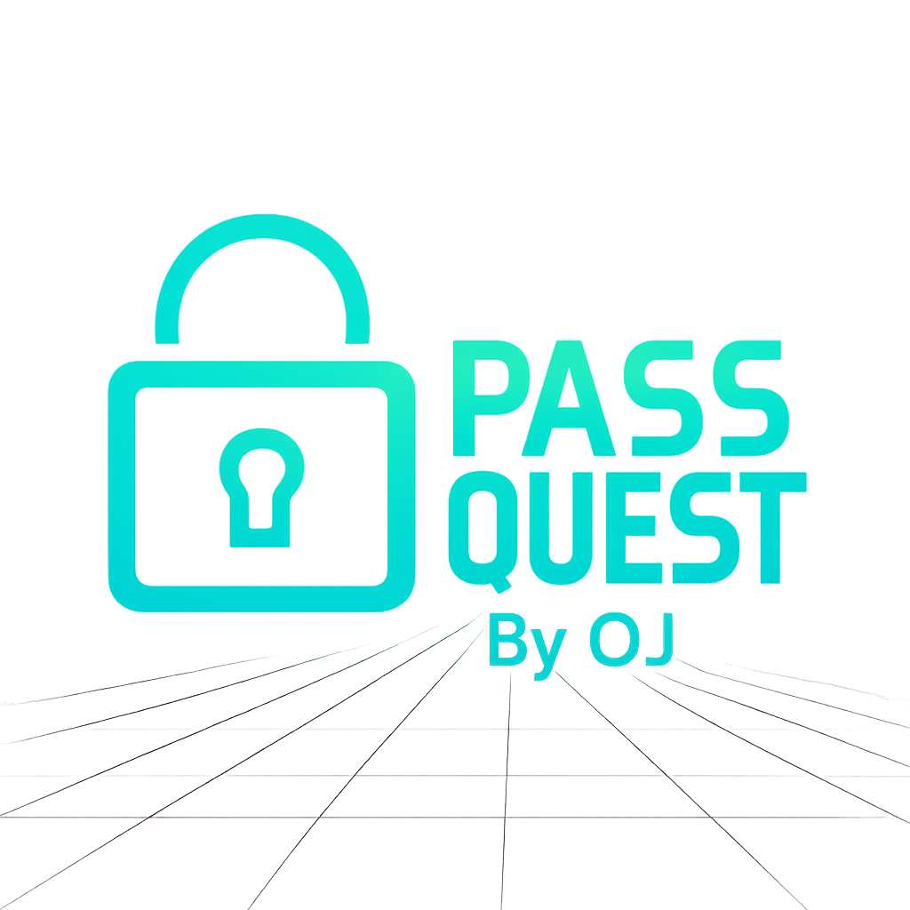

# 🔐 PassQuest

A gamified password strength checker with cyberpunk vibes.

## 🚀 Download
[](https://github.com/socwitholiver/passquest/releases/latest/download/app.exe)

Click the button above to download the latest PassQuest executable.

## 🖼️ Logo


## ✨ Features
- Entropy-based scoring
- Gamified strength levels: Weak → Legendary
- Neon loader, blurred background, and animated UI
- Splash screen with glowing logo
- Developed by Oliver Jackson, 2026 @OJLABS

## 🛠️ Installation
Clone the repo:
```bash
git clone https://github.com/socwithoj/passquest.git
cd passquest
pip install -r requirements.txt
